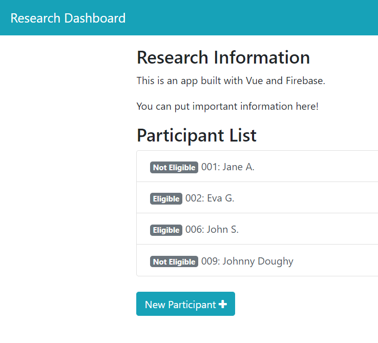

See all code on my [Github.](https://github.com/sidhantmathur?tab=repositories)

### [Peruzer](https://sidhantmathur.github.io/Peruzer/)

A fictional start-up website with a randomized clickable button. 

### [Javascript Platformer](https://sidhantmathur.github.io/Platforming-Game//)

A simple platforming game made with Javascript. Use arrowkeys to move. 

### Research Manager

Currently under development! Made with Vue.js, Bootstrap and Firestore. 

### [Employee Manager](https://vuefs-prod-c49dc.firebaseapp.com/#/)

An employee manager built with Vue.js, Materialize and Firestore. 

### [Javascript Quiz](https://sidhantmathur.github.io/JS-Quiz/)

A quiz applet made in Javascript. Can be adapted to other question banks for classifying quiz takers. 

### [Array Functions](https://sidhantmathur.github.io/Array-Functions/)

A simple applet that finds unions, intersections and differences between two input sets. 
